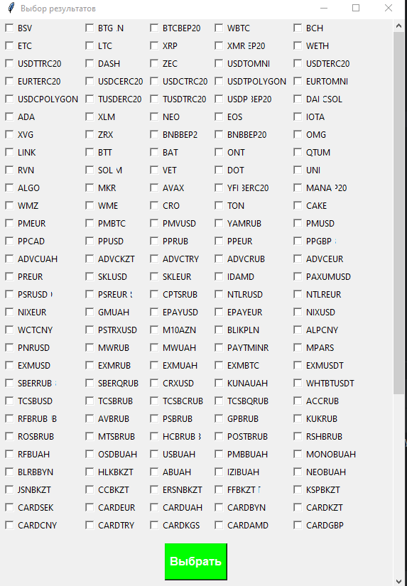

# webparser

Этот проект представляет собой скрипт, который отображает веб-интерфейс с полем выбора результатов с веб-страницы. Веб-страница, с которой получаются результаты, является страницей с курсами обмена валют.

Проект использует библиотеки tkinter, requests и BeautifulSoup для получения HTML-кода страницы и извлечения необходимых данных. С использованием библиотеки tkinter создается графический интерфейс с полем выбора результатов и кнопкой "Выбрать".

При запуске скрипта происходит получение HTML-кода с веб-страницы и парсинг его с помощью BeautifulSoup. Затем извлекаются нужные данные, в данном случае значения из элемента <td class="oddleft">, и добавляются в список результатов.

На основе списка результатов создаются поля выбора с использованием tkinter. Пользователь может выбрать желаемые результаты, и при нажатии на кнопку "Выбрать" будут выполнены соответствующие действия.

Код проекта содержит также логирование с использованием модуля logs, а также обработку исключений с выводом сообщений об ошибках в лог-файл.

